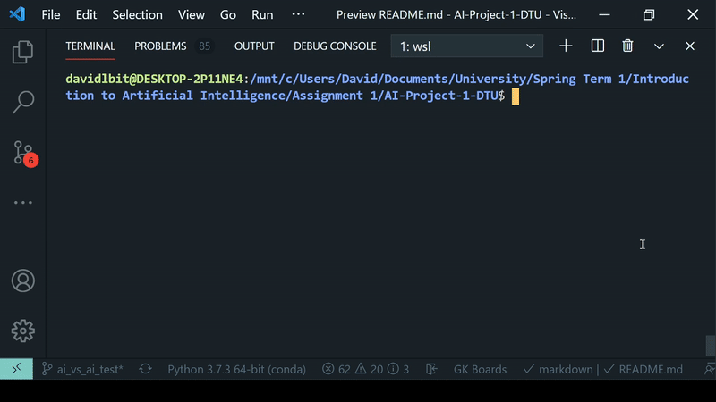

# Assignment 1: Kalaha board game

## Project objective
### Create an AI agent for the Kalaha board game based on the search algorithms presented in the lectures.

## Game rules
Kalaha is a competitive two-player game that can be played in several ways with various rules. The version considered in this assignment consists of a board with twelve pits and two so-called stores (or Kalahas). Each player controls one side of the board with six pits and one store. Initially, all pits are filled with a consistent number of stones. The board layout and the initial states are shown in the following figure.

This game turn-based and follows a short set of reasonably simple rules for legal actions and possible effects. Each turn, a player is allowed to make one action - the move action. This move is performed by taking all the stones in one pit and distributing them across the board. A move is only considered legal if the pit is non-empty and the player performing the move controls the pit.

The number of stones in the chosen pit will be distributed in a counter-clockwise fashion, increasing all following pits and store (skipping opponents store) with one until all stones are assigned a new position.  When the stones are distributed, a turn is considered, and the next player is allowed to make an action.  The players switch turns until one side is completely empty, and the game is over. The remaining stones on the board will be added to the player’s store with more stones left. A game is won by the player with more stones in their store.

### In addition to these basic rules, there are two special cases to be considered:
- *Capturing stones:* If the last stone is added to an empty pit on the player’s side,this stone, including all stones on the opponent’s side, is added to the player’s store
- *Go again:* If the last stone ends up in the player’s store, the player can move again

## Demonstration

Agent vs Agent          |  Player vs Agent
:-------------------------:|:-------------------------:
  |  

## Usage
Our implementation does not include a graphical user interface (GUI). Therefore it is necessary to create a
a game through the Command Line Interface (CLI) by running the file Kalaha.py

> $: python3 kalaha.py

After starting the file, the user is asked whether he wants to play against the AI agent himself
or if he wants to watch two agents playing against each other. The tree depth can be set in the main(), when calling the agents.

## Search algorithm
 For this implementation,the minimax algorithm with alpha-beta pruning was chosen. However, other methods and algorithms like reinforcement learning, stochastic- or Monte-Carlo tree search could be used for this agent.

 The minimax algorithm with alpha-beta pruning was implemented based on the pseudo code from chapter five of the book "Artificial intelligence a Modern approach 3rd edition", but with minor tweaks. As there is no frontier, the search algorithm creates deep copies of the game state initially passed and returns evaluations of each state recursively.

## Project structure
- Kalaha.py
  - This file initiates and runs the game.
- moves.py
  - This file contains all the functions related to moving/distributing the stones and calculating each players scores.
- algorithms.py
  - This file contains all the functions related to the the minimax algorithm (evaluation, check_valid_movec, etc.).
- game_state.py
  - This file contains the game_state class with the player attributes.
